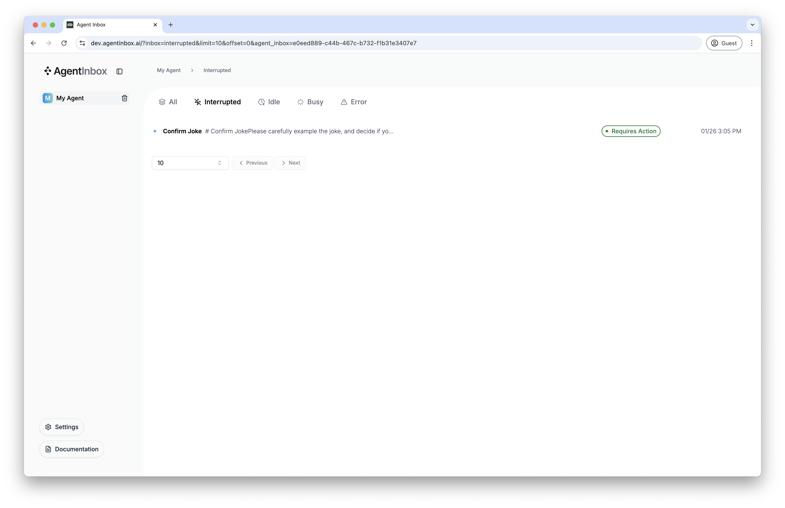
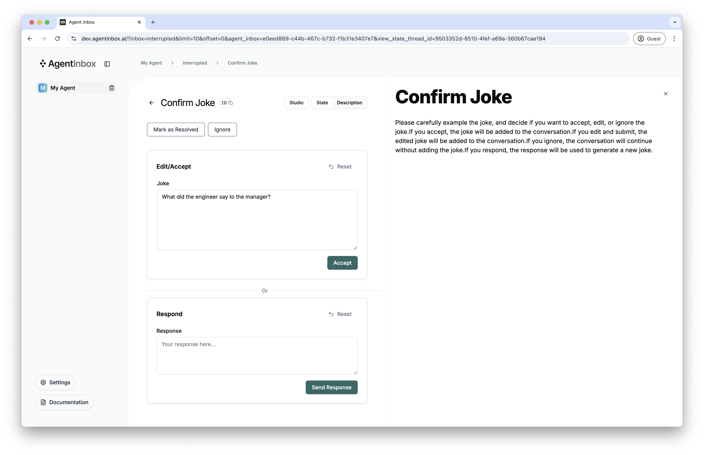

# Agent Inbox LangGraph Example

The repository contains a bare minimum code example to get started with the Agent Inbox with LangGraph.

## Getting Started

To get started, clone the repository:

```bash
git clone https://github.com/langchain-ai/agent-inbox-langgraph-example.git
```

```bash
cd agent-inbox-example
```

Then, install the dependencies:

```bash
poetry install
```

Next, install the [LangGraph CLI](https://langchain-ai.github.io/langgraph/cloud/reference/cli/) if not already installed. We're installing the in-memory version so we can run the LangGraph server without Docker.

```bash
pip install -U "langgraph-cli[inmem]"
```

After this, we can start the LangGraph server:

```bash
langgraph dev
```

This may take a second to start. Once the server is running, it should open a new browser tab to the LangGraph Studio through LangSmith. If this does not happen automatically, visit this URL:
[https://smith.langchain.com/studio/thread?baseUrl=http%3A%2F%2F127.0.0.1%3A2024](https://smith.langchain.com/studio/thread?baseUrl=http%3A%2F%2F127.0.0.1%3A2024)

Now that our LangGraph server is running, we can start a new run in the Studio. To do this, simply enter any string into the `Interrupt Response` field, then click the `Submit` button. This will execute the graph, and interrupt on the `human_node`. Once the graph has interrupted, we can visit the Agent Inbox site to add your graph, and manage the interrupted thread.

## Agent Inbox Setup

Visit [`dev.agentinbox.ai`](https://dev.agentinbox.ai). If it's your first time visiting the site, you'll be prompted to add a new graph.

Enter the following fields into the form:

- Graph/Assistant ID: `agent` - this corresponds to the ID of the graph defined in the [`langgraph.json`](./langgraph.json) file, or the ID of an assistant tied to your graph.
- Deployment URL: `http://127.0.0.1:2024` - this is the URL of the LangGraph server running locally.
- Name: `My Agent` - this is the optional name of the graph. You can set this to any value you want, or leave it empty and it'll be auto-assigned.

Click `Submit` and watch your graph appear in the sidebar. This should automatically fetch the interrupted threads, but if it does not, click on the sidebar item & refresh the page. Once you've done this, you should see a single interrupted item in the table:



Click on this row, and you'll be taken to the interrupted item page. From here, you can respond in any way you'd like:

- Accept
- Edit
- Respond
- Ignore



Once you take an action, the graph will resume the execution and end. The final state returned from the graph will be a string containing the type of action which was taken, and the value of the action args (unless `ignore` was chosen).

To view the result of the graph, go back to the LangGraph Studio and inspect the most recent thread results.


## Go Deeper

If you'd like to go deeper, you can:

- Checkout the Agent Inbox docs, and codebase here: [github.com/langchain-ai/agent-inbox](https://github.com/langchain-ai/agent-inbox)
- See an open source Executive AI Assistant here: [github.com/langchain-ai/executive-ai-assistant](https://github.com/langchain-ai/executive-ai-assistant)
- See an open source Social Media Agent here: [github.com/langchain-ai/social-media-agent](https://github.com/langchain-ai/social-media-agent)
